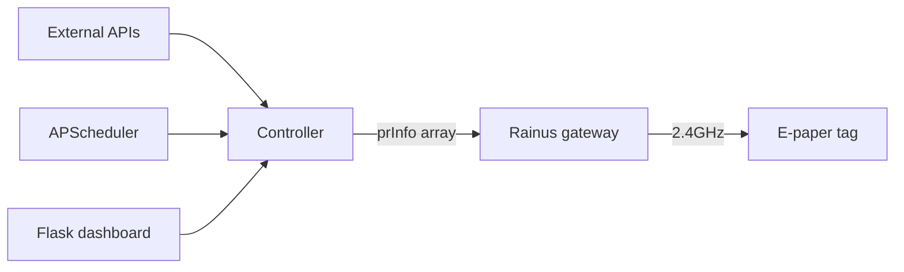

# ESL Hub

Retail electronic shelf labels, repurposed as always-on household dashboards.

A Flask app on a Raspberry Pi pulls from external APIs on a schedule and pushes
rendered payloads to a set of Rainus InforTab e-paper tags. The tags refresh a
few times a day, draw no power between refreshes, need no wires, and stay
readable in daylight.

## What is on the wall

| Dashboard | Pulls from | Layout |
|---|---|---|
| Weather | Open-Meteo, three cities | `4p20c_Weather` |
| Fitness | Strava, monthly activity grid and heart rate | `4p20c_Fitness` |
| Energy | Shelly Cloud, whole-house consumption | `4p20c_Energy` |
| Formula 1 | Jolpica/Ergast, next race weekend and standings | `4p20c_Formula1` |
| Dota 2 | OpenDota, MMR progress | `4p20c_Dota` |
| Mercedes | A scraper on a remote VM, over SCP | `4p20c_WebScraper` |
| Family calendar | Google Calendar, today and what is coming up | `4p20c_SharedCalendar` |

## How it works



A controller fetches data, formats it into a flat array of strings, and POSTs
that array to the gateway along with a tag ID and a layout ID. The gateway
renders the layout against the array and transmits the image to the tag over its
own 2.4GHz radio.

Nothing about the visual design lives in this repository. Layouts are built in
the vendor's Layout Designer, and a controller only decides what goes into each
slot.

## Hardware

- Raspberry Pi 3 Model B, Debian 12
- Rainus InforTab all-in-one gateway, which is both gateway and server
- InforTab R420 tags: 4.20 inch, 400 x 300 px, roughly 120 dpi, three inks only
  (black, white, red)

## Anatomy of a controller

Every controller exposes a single entry point and reads everything it needs from
the config it is handed. Nothing is hardcoded.

```python
def run(full_config):
    sys_cfg = full_config["system"]      # gateway_ip, store_code
    cfg = full_config["your_section"]    # tag_id, credentials, schedule

    pr_data = [""] * 250                 # index N maps to PR_N in the layout
    pr_data[150] = "27"
    pr_data[151] = "september"

    requests.post(f"http://{sys_cfg['gateway_ip']}/api/product", json={
        "storeCode": sys_cfg["store_code"],
        "taskId": str(int(time.time())),
        "product": [{
            "prCode": cfg["tag_id"],
            "layoutId": "4p20c_YourLayout",
            "prInfo": pr_data,
            "nfc": "",                   # omitting this returns a 500
        }],
    })
```

Register it in `app.py` in three places: the import, the scheduler's `job_map`,
and the manual trigger map. Add a settings tab in `templates/index.html` and a
matching `process_tab` call if it needs one.

The array must be at least as long as the highest index you write. Controllers
here range from 100 to 300 entries depending on which block of PR numbers their
layout uses.

## The layout side

Layouts are authored in the vendor's Layout Designer and stored on the gateway,
so they are versioned nowhere. Worth knowing:

- The canvas for a 4.20 inch tag is **400 x 300 px**.
- A text, image or barcode object either shows static content or binds to a
  **PR Info ID**. That ID is the index into the `prInfo` array the controller
  sends.
- PR numbers are scoped to a layout, not globally. Two layouts can both use
  index 100 without interfering, because each tag carries its own array.
- Any object can be made conditional through **Edit Condition**, which uses a
  small symbol language rather than raw code:

```python
if PR_162 == '1':
    FILLED_COLOR = RED
    LINE_COLOR = RED
elif PR_162 == '2':
    FILLED_COLOR = BLACK
    LINE_COLOR = BLACK
else:
    HIDE = TRUE
```

  The designer compiles that into a `pr_info[...]` / `properties[...]` form and
  stores both. Author the symbol version, never the compiled one.

- `OBJ.YS` and `OBJ.HEIGHT` are settable the same way, so a layout can be made
  responsive. The family calendar uses this to move its divider and reflow its
  upcoming rows depending on how busy today is.

## Setup

```bash
git clone git@github.com:desigrit/esl-home-hub.git
cd esl-home-hub
pip install flask apscheduler requests "PyJWT[crypto]"
cp config.example.json config.json   # then fill in your own values
python3 app.py                       # dashboard on :5000
```

Python 3.9 or newer, for `zoneinfo`. `PyJWT` needs the `crypto` extra because the
calendar controller signs its service account assertion with RS256.

Run it under systemd in production. The unit runs `app.py` directly as a normal
user with `Restart=always`.

**Restart the service after editing any `.py`**, otherwise manual triggers in
the dashboard keep running the old code.

```bash
sudo systemctl restart esl_hub
```

### Google Calendar access

The family calendar controller authenticates as a Google Cloud **service
account**, which avoids a browser consent step and a refresh token that expires
on a headless device.

1. Create a project, enable the Google Calendar API, create a service account
   and download a JSON key.
2. Put the key at `controllers/data/google_service_account.json`.
3. Share each calendar with the service account's email address, with
   "See all event details".
4. Take the calendar ID from Settings and sharing, under Integrate calendar, and
   put it in `calendar_ids`.

Sharing a calendar with a service account grants access but never adds it to
that account's own calendar list, so `--list-calendars` will look empty. That is
expected. Address calendars by ID.

```bash
python3 controllers/family_controller.py --check <calendar_id>
python3 controllers/family_controller.py --dry-run
```

## Configuration

`config.json` holds credentials and is deliberately untracked. Every controller
gets a section:

```json
{
  "system": { "gateway_ip": "...", "store_code": "..." },
  "family": {
    "enabled": true,
    "tag_id": "...",
    "service_account_file": "controllers/data/google_service_account.json",
    "calendar_ids": ["..."],
    "timezone": "America/Los_Angeles",
    "upcoming_days": 120,
    "mode": "schedule",
    "times": ["06:00"],
    "days": 1
  }
}
```

`mode` is either `interval`, using `interval` in minutes, or `schedule`, using
`times` and a `days` gap.

It is strict JSON. A trailing comma stops the app from starting.

## Repository layout

```
app.py                  Flask app, scheduler, routes
controllers/            one module per data source
templates/index.html    dashboard
static/                 vendored bootstrap
```

Not in the repository, by design: `config.json`, `logs.json`, run logs,
`controllers/data/` (API keys and runtime state), and the layouts themselves.

## Notes

- The gateway sits on its own network segment behind the Pi and is not routable
  from the LAN. The Pi proxies its web UI.
- Strava rotates its refresh token on every use, and the controller writes the
  new one back into `config.json`. Do not overwrite that file while a run is in
  flight.
- The Mercedes controller runs from cron rather than the in-app scheduler and
  has no dashboard tab.